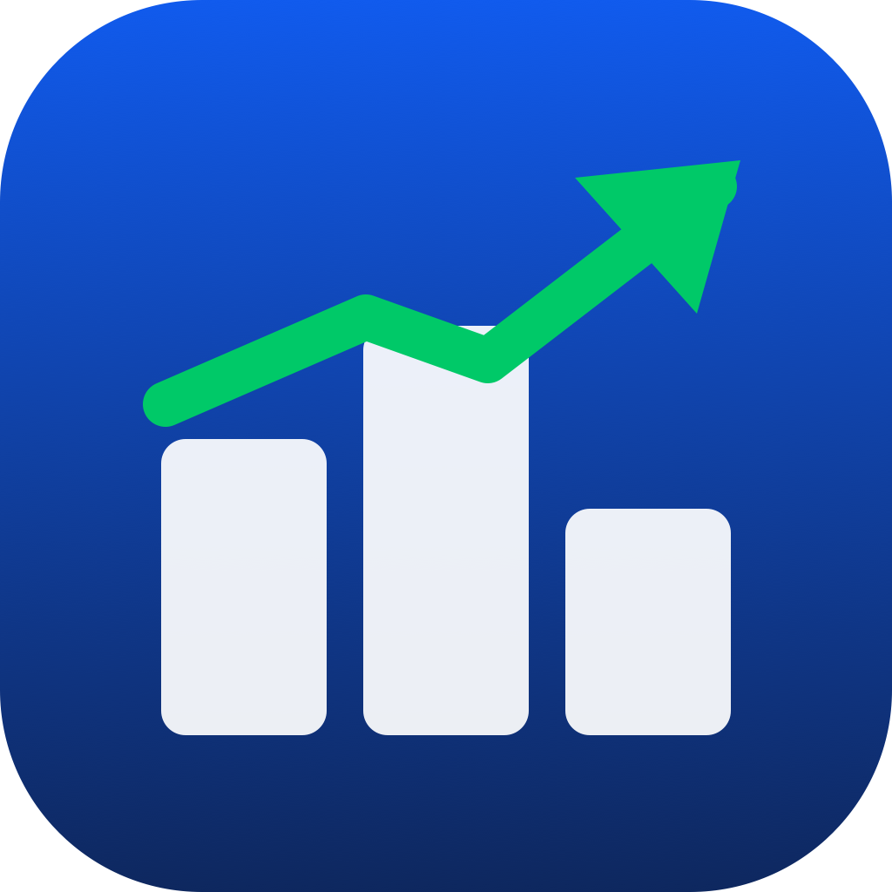
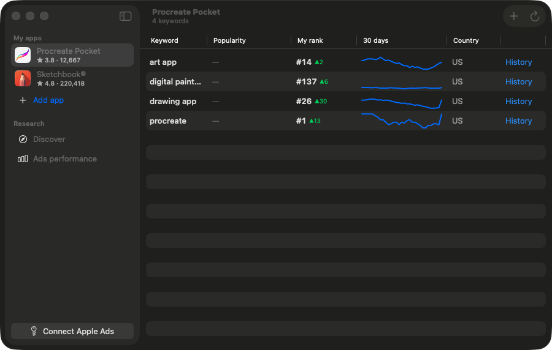

<p align="center">
  
</p>

<h1 align="center">Podium</h1>

<p align="center">
  <b>Free, open-source App Store optimization for indie developers.</b><br/>
  Track keyword rankings, see Apple's official popularity data, and watch your apps climb.<br/>
  Native macOS app · your data never leaves your Mac · no servers · no subscription.
</p>

<p align="center">
  <a href="https://github.com/SyntaxFear/Podium/actions/workflows/ci.yml"></a>
  
  
  
</p>



## Why Podium

ASO tools cost $50–500/month. Most indie devs fly blind instead.

Podium is the third option: a native Mac app that does the essential ASO loop — *which keywords matter, where do I rank, am I improving* — for free, forever. It's the first open-source tool built on the **official Apple Ads Platform API** (released August 2026), so popularity numbers come from Apple, not from scraping.

## What it does

- **Keyword rank tracking** — your position in App Store search results for any keyword, in any of 175 storefronts, with daily history and charts.
- **Official popularity scores** — Apple's 0–100 popularity for your tracked terms (via your free Apple Ads account).
- **Discover** — browse Apple's official *most searched terms* per country and category; one click to start tracking any of them.
- **Ratings watch** — current rating and count for every app you track.
- **Menu bar + notifications** — today's movements at a glance; get notified when a rank changes.
- **CSV export** — your data is yours.
- **Read-only by design** — Podium can see your Apple Ads data but can never spend a cent or change a campaign.

## Privacy

There is no Podium server. The app talks only to Apple (`itunes.apple.com`, `api.searchads.apple.com`, `appleid.apple.com`). Credentials live in your macOS Keychain; history lives in a local SQLite file. Delete the app and it's all gone.

## Install

**Download:** grab the latest zip from [Releases](https://github.com/SyntaxFear/Podium/releases), unzip, drag **Podium.app** to Applications.

> The app is not yet notarized: the first time, **right-click → Open → Open** (once per install).

**Build from source:**

```bash
git clone https://github.com/SyntaxFear/Podium.git
cd Podium
brew install xcodegen
xcodegen generate
xcodebuild -project Podium.xcodeproj -scheme Podium -configuration Release build
```

Requires Xcode 16+ / macOS 15+.

## Getting started

1. Launch Podium → **Start tracking now** (zero setup).
2. **Add app** → search any App Store app — yours, or a competitor's.
3. Add the keywords people would use to find it. Ranks appear immediately; charts build daily.

### Unlock official Apple data (optional, ~5 minutes)

Apple's popularity numbers require a free [Apple Ads](https://ads.apple.com) account — no campaigns, no payment method needed:

1. Create the Apple Ads account (free) and, in **User Management**, invite a user with the **API Account Manager** role. *Apple quirk: the API user must be a different Apple Account than the admin, and the invited email must be that account's primary email.*
2. In Podium, click **Connect Apple Ads**. The app generates a secure key on your Mac and shows you exactly what to paste where.
3. Paste the public key in Apple Ads → Account Settings → API (signed in as the API user), copy the credentials block back into Podium, done.

The private key never leaves your Keychain. Podium requests read-only scope.

## Architecture

```
Podium/
├── App/            SwiftUI macOS app (wizard, keywords, discover, settings, menu bar)
├── Sources/
│   ├── PodiumKit/  Reusable engine: ES256 OAuth, Ads API client, rank checker,
│   │               GRDB storage, refresh + diffing, CSV export — fully unit-tested
│   └── PodiumSmoke/ CLI for live smoke tests (`swift run podium-smoke rank ...`)
└── Tests/          25 XCTest cases, all mocked — `swift test`
```

PodiumKit is UI-free on purpose: a CLI or MCP server for AI agents can reuse the same engine (planned).

## Roadmap

- Campaign reports (read-only) once the new reporting endpoints are verified against live accounts
- Notarized builds + Homebrew cask
- Competitor keyword tracking, review monitoring
- MCP server so AI assistants can query your ASO data
- Google Play

Issues and PRs welcome.

## License

[MIT](LICENSE) — built by [Levan Parastashvili](https://github.com/SyntaxFear).
